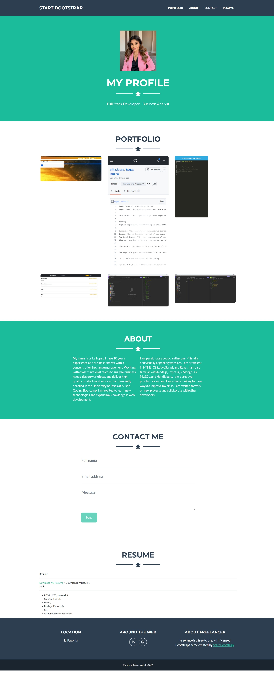

# Portfolio

# Description 
This application is a personal portfolio that showcases an about me section, previos work, a contact me section and a resume download section for recruiters and job opportunities.

# Installation

To install the project dependencies, follow these steps:

- Fork and clone the repository Professional-README-Generator.
- Run npm i to install dependencies in the local project directory.

# Usage

- Open integrated terminal.
- Run npm start 

# Contributing

1. To fork this project, click the "fork" button at the top of the repository
2. Choose your personal account when asked `Where should we fork?"
3. After a few seconds you will be taken to your copy of the repository
5. Visit the fork that you just created on GitHub and copy the URL of your fork.
6. Clone your fork of the repository to your local machine and move into that directory:
7. Run the following command to see that the remote URL for the repository is set to your own personal Github:
8. Create a branch of your own.
9. Make some additions or changes to the readme file and stage and commit your work.
10. Push your changes to the remote branch.
11. Back on the forked repository page, you should see a yellow bar at the top with a button to "Compare and Pull Request". Click that button.
12. Click "Create Pull Request". The owner of the project will get an email notification that some changes have been made and that a pull request is ready for their review.
13. The owner can approve or reject the pull request and optionally add some additional comments for your review. While this is a simple edit we are making to the readme.md file, you can imagine a situation where your code would require some additional review.

# Questions
For additional questions or concerns regarding the README file, contact:

Github: erikaylopez
Email: eylopez8686@gmail.com

# Live Demo 

[Live Demo](https://velvety-choux-8e7beb.netlify.app/#portfolio)

# Screenshot 

